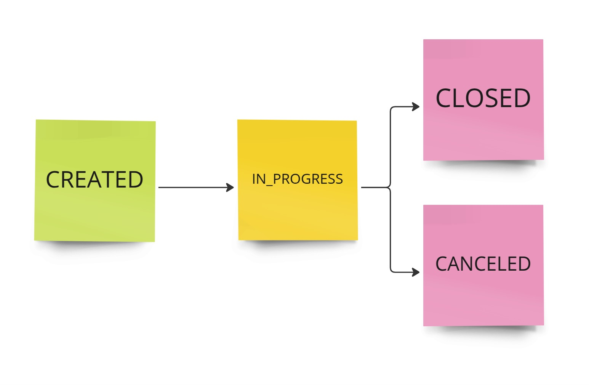
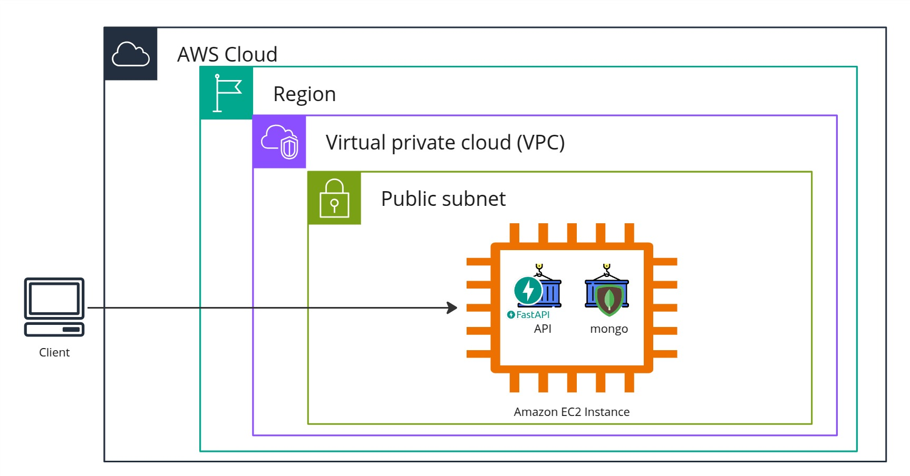

# CarServiceAPI
API diseñada para gestionar el mantenimiento y servicio de vehículos en una empresa transportista.
Este challenge es una oportunidad para que muestres tu código más limpio y demuestres cómo solucionas problemas.
# Instrucciones
- Desarrollar una solución mínima para el requerimiento descrito en la sección "Problema".
- Entregar el código de la solución en forma de un repositorio de Github e incluir instrucciones de instalación.
- Proveer una solución que pueda ejecutarse offline.
- Utilizar el lenguaje de programación Python >= 3.7.
- Utilizar la base de datos que se considere apropiada, la cual deberá ser accesible de forma local mediante contenedores.
- Hacer uso de Docker y proveer instrucciones de instalación.
- Agregar los comentarios que se consideren pertinentes.
- Nombrar/crear en inglés las clases, variables, comentarios, etc.
- Incluir pruebas unitarias y de integración.
- Enumerar y describir los casos de uso soportados por la solución.
- Proveer la documentación necesaria, incluyendo archivos Swagger/OpenAPI y diagramas de arquitectura.
- Agendar una llamada para sustentar la solución.

## Problema
Una empresa transportista requiere administrar los procesos asociados al mantenimiento de sus vehículos. Se requiere soportar las siguientes funcionalidades:

1. **Registro de vehículos**.
2. **Gestión de órdenes de servicio (de mantenimiento)**.

Se requiere desarrollar el backend para la solución descrita, el cual se accederá vía API.

### Sugerencias
- Establecer los casos de uso que serán soportados desde el principio.
- Registrar solo información/datos necesarios para demostrar el potencial de la solución.
- Para la entidad de orden de servicio, hacer uso de una máquina de estados finitos e incluir información sobre la operación de mantenimiento a realizar/realizada y las partes mecánicas involucradas.
- El uso de frameworks es opcional.
- No se espera una solución extensa, sino un MVP que demuestre que el problema puede ser resuelto.

## Propuesta de solución
El sistema está diseñado para realizar una manipulación básica **CRUD** de los vehículos, permitiendo:
- Crear, actualizar y eliminar vehículos.
- Mostrar múltiples vehículos paginados.
- Consultar información específica de cada vehículo.

Además, se cuenta con un módulo para la gestión de **órdenes de servicio**, el cual es más complejo e incluye:
- Creación de órdenes de servicio.
- Consulta de información detallada de cada orden.
- Modificación de algunos datos básicos como el tipo de servicio y la descripción.
- Uso de **comandos** para avanzar en el flujo de las órdenes mediante los siguientes estados:
  - `in_progress`: La orden entra en estado de ejecución.
  - `canceled`: La orden es cancelada.
  - `closed`: La orden se finaliza y se marca como completada.



Este enfoque permite una gestión clara y estructurada de los servicios de mantenimiento, asegurando que cada orden siga un flujo bien definido.


## Requisitos
- Python 3.11+
- Docker
- MongoDB

### Clonar el repositorio
```bash
git clone https://github.com/GerardoX1/CarServiceAPI
cd CarServiceAPI

```
## Infraestructura propuesta
En el siguiente esquema se muestran una posible implementación a corto plazo de esta solución ya sea para probar o para presentarla de manera funcional.



## Dockerización
Con Docker configurado en tu PC, lo único que tienes que hacer es ejecutar el comando:
```bash
docker-compose up
```

## Servicios en Docker
- Aplicación Web: Disponible en [http://localhost:8080](http://localhost:8080)
- Base de Datos MongoDB [http://localhost:27017](http://localhost:27017)

## Configuración de desarrollo
Es importante primero ejecutar la dockerizacion para tener las bases de datos arrancando antes de comenzar a realizar la carga de informacion.
tambien es recomendable validar el estado de estos contenedores cuando se hacen pruebas locales.


### Crear y activar un entorno virtual
```bash
python3 -m venv venv
source venv/bin/activate # En Windows usa venv\Scripts\activate
```

### Instalar dependencias
```bash
pip install -r requirements.txt
```

### Ejecutar el servidor de desarrollo
```bash
python main.py
```

### Ejecutar pruebas unitarias
```bash
pytest
```

